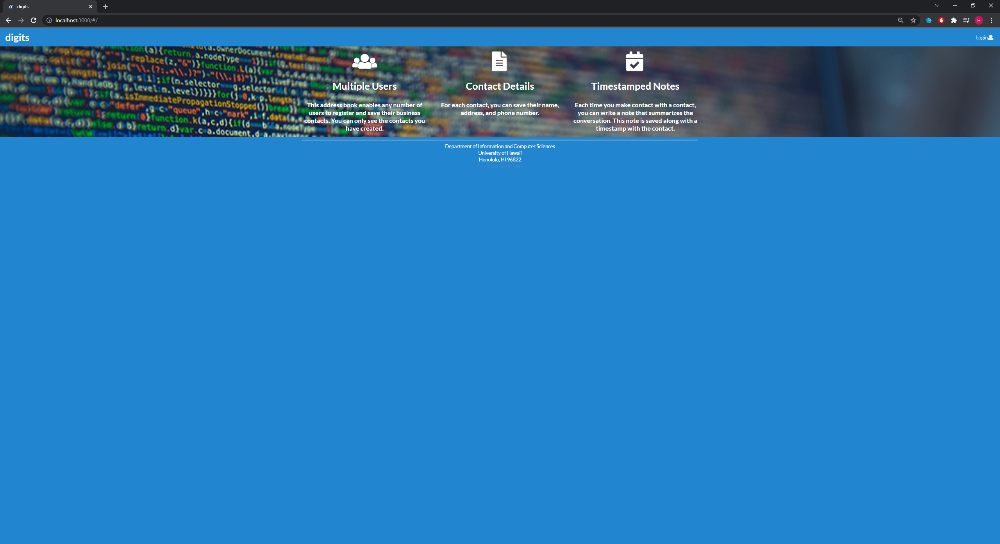
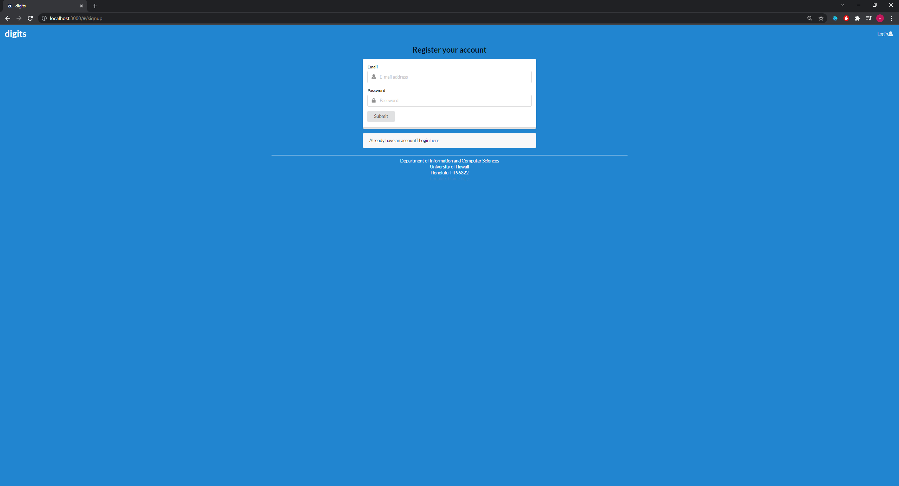
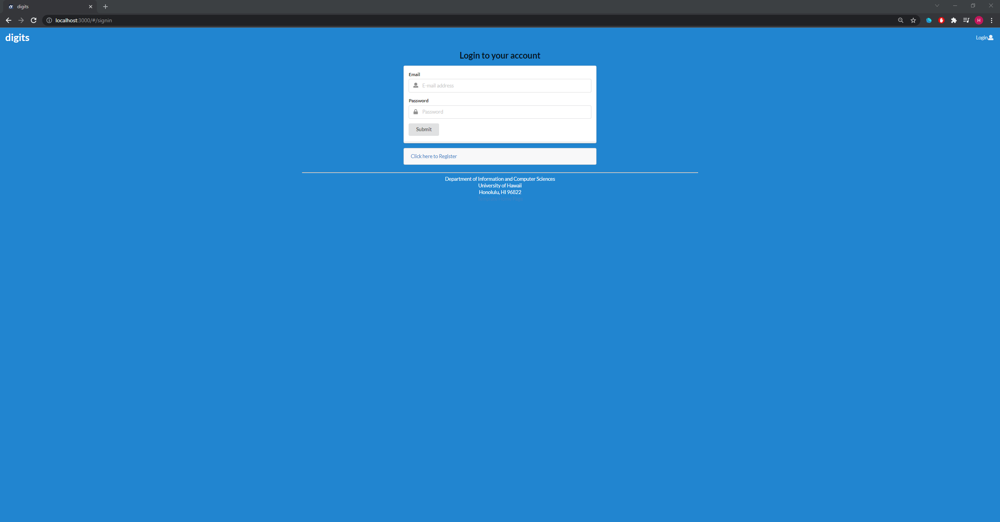
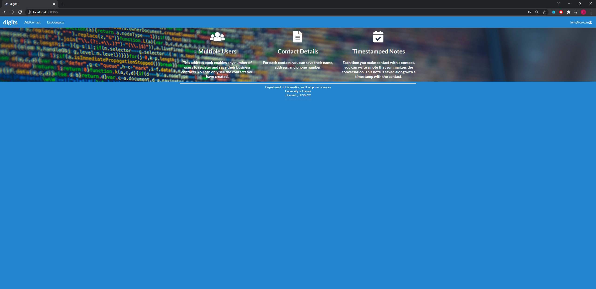
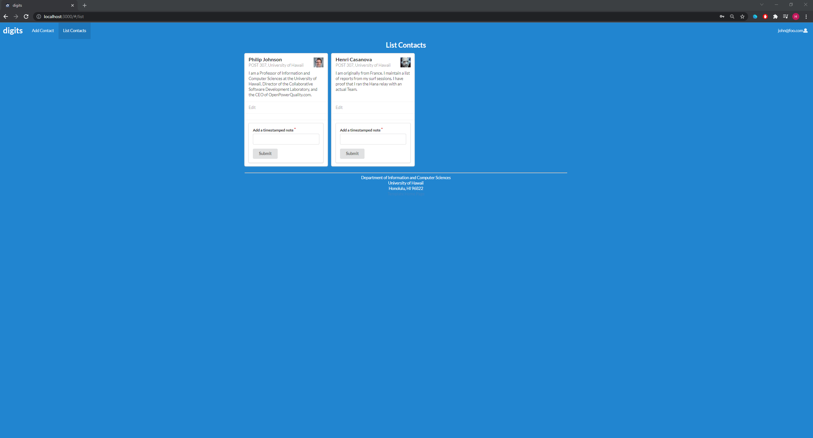
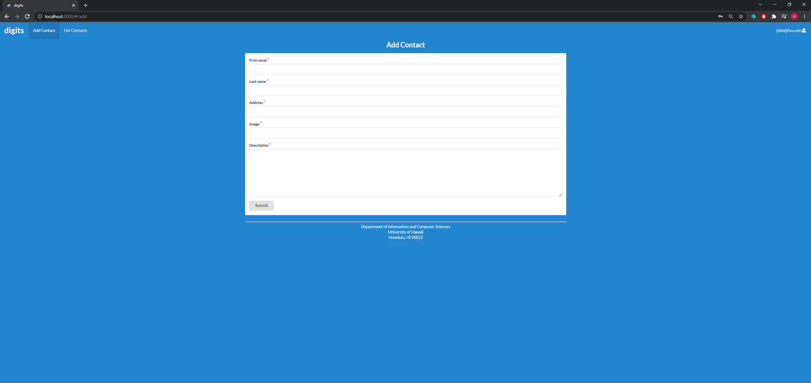
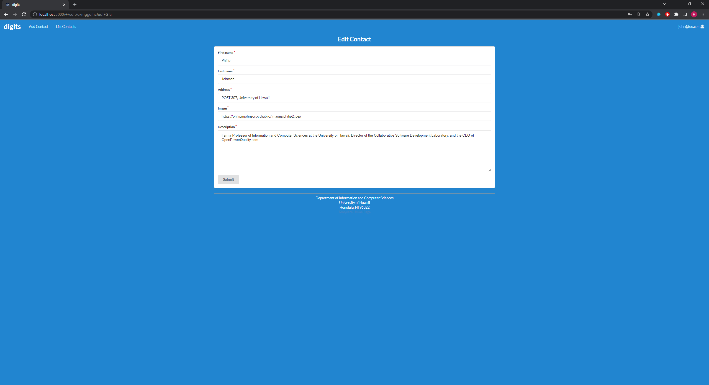
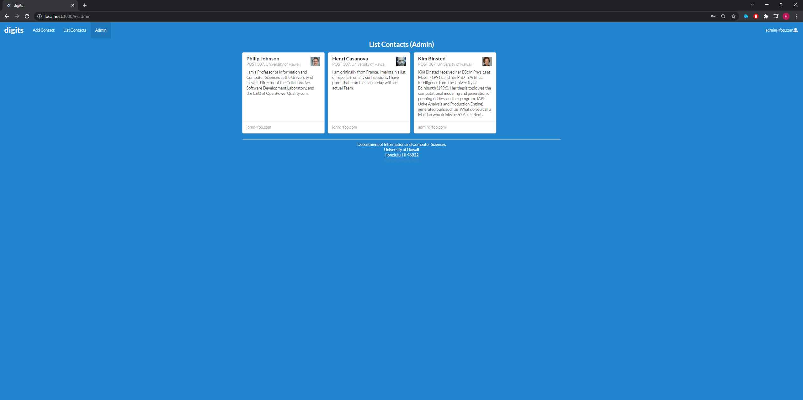

Digit is an application that allows users to:

  * Register an account and Sign-in/Sign-out
  * Create and view a set of contacts/timestamped notes
  * 
## Installation Guide

First, [install Meteor](https://www.meteor.com/install).

Second, [download of copy of Digits](https://github.com/eric-song1773/digits), and click the "Use this template" button and create a new repository that you own that is initialized with this template's files. "Clone or download" button to download your new GitHub repo to your local file system.  Using [GitHub Desktop](https://desktop.github.com/) is a great option if you are Windows/Mac User.

Fourth, cd into the app/ directory of your local copy of the repo, and install third party libraries with:

```
$ meteor npm install
```

## Running the system

Once the libraries are installed, run the application begin with:

```
$ meteor npm run start
```

The first time you run the app, it will create some default users and data shown below (example output):

```
meteor npm run start

> meteor-application-template-react@ start C:\Users\songk\OneDrive\Documents\GitHub\digits\app
> meteor --no-release-check --exclude-archs web.browser.legacy,web.cordova --settings ../config/settings.development.json

[[[[[ C:\Users\songk\OneDrive\Documents\GitHub\digits\app ]]]]]

=> Started proxy.
=> Started MongoDB.
I20211109-21:51:45.794(-10)? Creating the default user(s)
I20211109-21:51:45.796(-10)?   Creating user admin@foo.com.
I20211109-21:51:45.872(-10)?   Creating user john@foo.com.
I20211109-21:51:45.939(-10)? Creating default contact.
I20211109-21:51:45.940(-10)?   Adding: Johnson (john@foo.com)
I20211109-21:51:45.952(-10)?   Adding: Casanova (john@foo.com)
I20211109-21:51:45.953(-10)?   Adding: Binsted (admin@foo.com)
I20211109-21:51:45.981(-10)? Monti APM: completed instrumenting the app
=> Started your app.

=> App running at: http://localhost:3000/
   Type Control-C twice to stop.
```

### Viewing the running app

If everything processes without any errors, the template application will appear at [http://localhost:3000](http://localhost:3000).  You can login using the credentials in [settings.development.json](https://github.com/ics-software-engineering/meteor-application-template-react/blob/master/config/settings.development.json), or creating a new account also an option.

### ESLint

ESlint can be used to check coding standards by typing in the terminal:

```
meteor npm run lint
```

## UI (User-Interface) Walkthrough

The following sections describe the major features of this template.

### Landing Page


The User will be introduced with landing page, which description the general purpose of this application.

### Register



New account can be created using "Register" feature.

### Sign-in



After an account has been created, user can sign in using "Login to your account" page.

### User Home Page



After user logs in using valid account, the user will be greeted with page similar to landing page, but the user can now interact with different features in NavBar. 

### List Contacts



By Clicking "List Contacts", user will be greeted with group of contacts. Users can also leave a timestamped note underneath the contact.

### Add Contact



By Clicking "Add Contact", user can add a new contact into the list of contacts. When finished, press "submit" to add a contact. 

### Edit Contact



User is also allowed to edit the contact as much as they want using "Edit Contact" feature. After all changes are made, press submit to save changes.  

### Admin Mode



If the account is considered as admin account, another tab is created in the NavBar, where it can access all contacts created by all users. 
